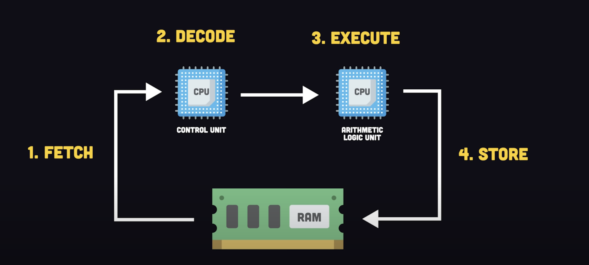
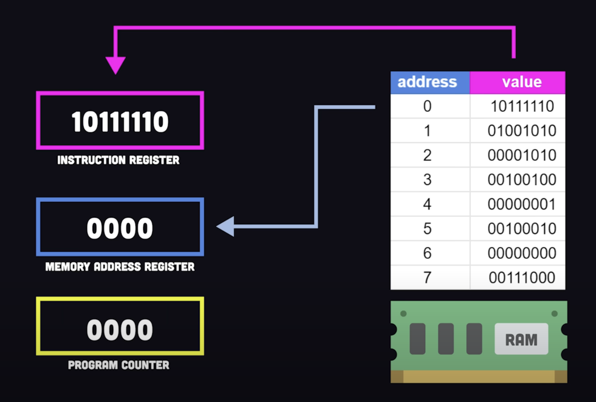
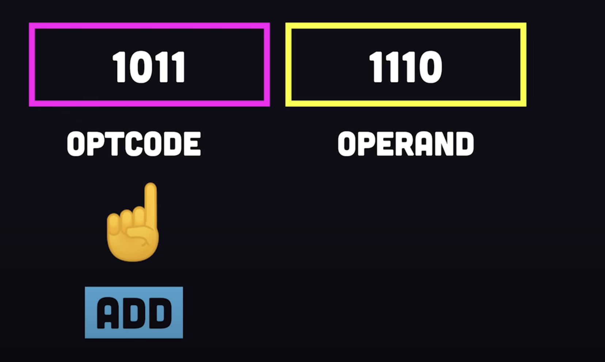
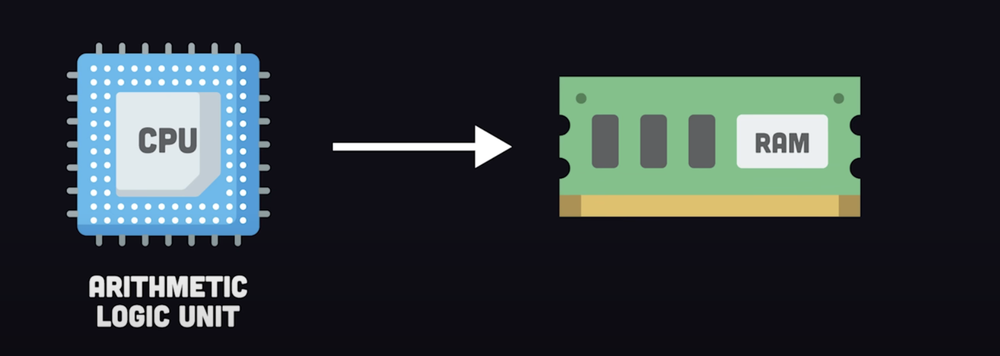
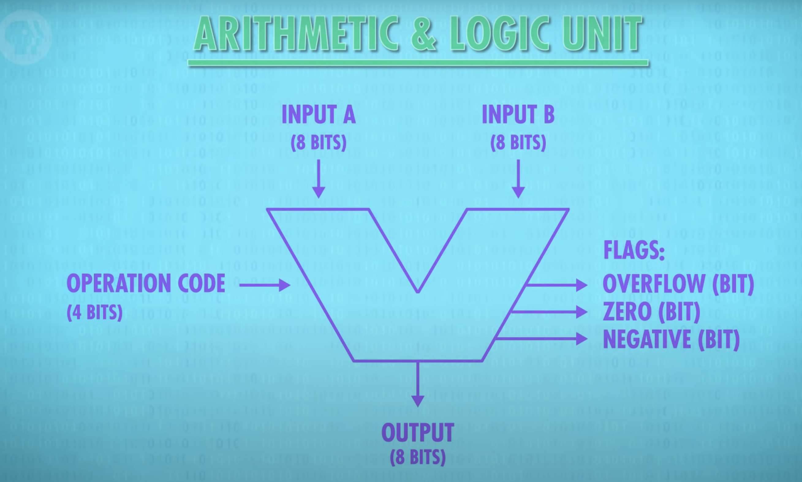
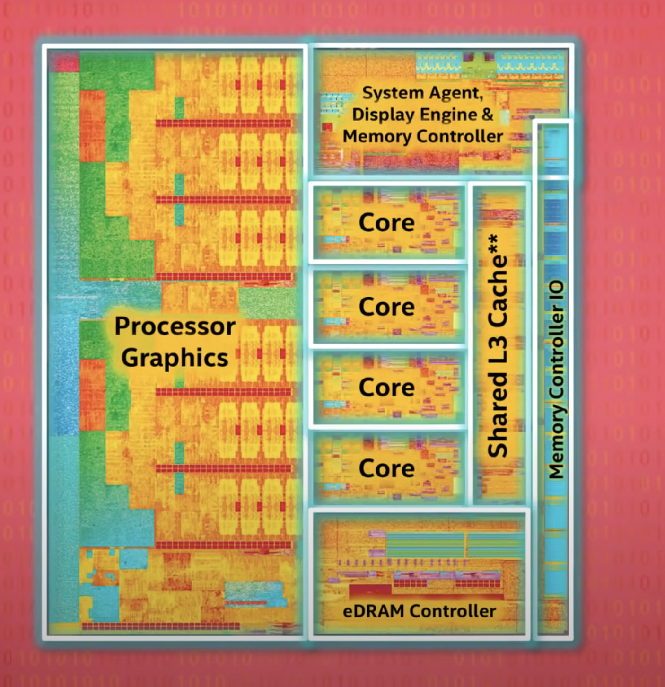

### Machine cycles
  
1. fetch  
The CPU’s control unit fetches the instruction from memory. The address of this instruction is stored in the program counter, which is incremented after the fetch operation to point to the next instruction.
 
2. decode  
The fetched instruction is then decoded by the instruction decoder inside the control unit. This determines what operation needs to be performed and what the operands are.
 
3. execute:  
ALU  
The operation is performed by the appropriate component of the CPU. In your diagram, this is the ALU (Arithmetic Logic Unit) which performs arithmetic and logical operations.  
 
4. memory  
If the instruction involves memory access (such as loading data or storing results), this is the stage where that happens. The data is read from or written to memory.
5. write back  
The results of the execution are saved in the destination register.

## Processors
CPU: execute programs
  

ALU: Arithmetic & Logic Unit
 

## Processor Design
1. instruction sets  
2. cache: dirty bit
3. Instruction pipelines: parallelize
4. Conditional Jump instructions: speculative execution "guess"
5. Superscalar CPU
6. Multi CPU
7. Super Computer